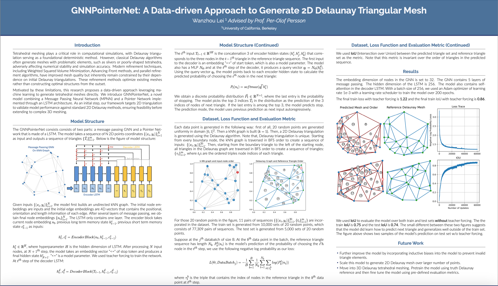

# GNNPointerNet

This repository contains code for training a GNNPointerNet model 
to generate **2D Delaunay-like meshes** from point coordinates.

It is basically an immitation of Delaunay Meshing. The input is a sequence 2D points and the output is a sequences of triangles. 

## Project Poster
[](assets/MeshingPoster.pdf)

## Repo Structure
- `data/` 
    - `data.py` the script that contains all the tools to generate the dataset.
    - `generate_datasets.py` run this script to generate one train and one test dataset. 
- `gnnpointernet/` — main source code
    - `losses/loss_functions.py` the script that contains the training loss and evaluation metrics. 
    - `models/model.py` the script that contains the model structure and definitions. 
    - `utils/util.py` the script that contains the plotting tool. 
- `experiments/` training and evaluation code 
    - `train.py` the script that builds and trains and log a GNNPointerNet model.
    - `evaluate.py` the script that loads the logged models and evaluates the model. 
- `notebooks/` Jupyter notebooks of my scratch codes and others. 
- `assets/`
    - `MeshingPoster.pdf` my poster for this project
    - `poster_preview.png` a preview png image of the poster. 

## Getting Started
### Install All The Dependency
```bash
pip install -r requirements.txt
```

### Generate Training and Testing Datas
In `GNNPointerNet/data/` folder, run the following bash code:
```bash
python generate_datasets.py
```
The code generates a training set that contains 10,000 delaunay graphs of 20 points and a test set that contains 5,000 delaunay graphs with 20 points. Each dataset consists of many pairs of sequences $(\{(x_i, y_i) \}, {t_i}  )$.

The first sequence is a sequence of coordinates of points, traversed in BFS order in the knn graph (k = 5). The second sequence if a sequence of triangles, traversed in BFS order in the delaunay graph. Triangles are considered connected iif they share an edge. Because of the difference ways to traverse the points and triangles, there are more than 10,000 pairs of sequences in the train dataset and more than 5,000 pairs of sequences in the test dataset. 

Feel free to tweak the code to generate differnet dataset. 

### Build and Train the Model
In the root folder, run the following bash code:
```bash
python -m experiments.train
```
This code runs the `train.py` script in the default setting, which is the setting I used to train the model. But you can always run the code using different arguments:
```bash
python -m experiments.train [options]
```
to build and train the model using different hyperparameters. Look into the usage documentation in the header of `train.py` to see the details. `train.py` script also logs and saves the models and the loss, iou trace, in the `./experiments/checkpoints/` folder, which we will use later. 


